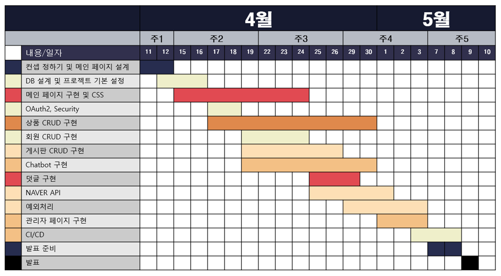
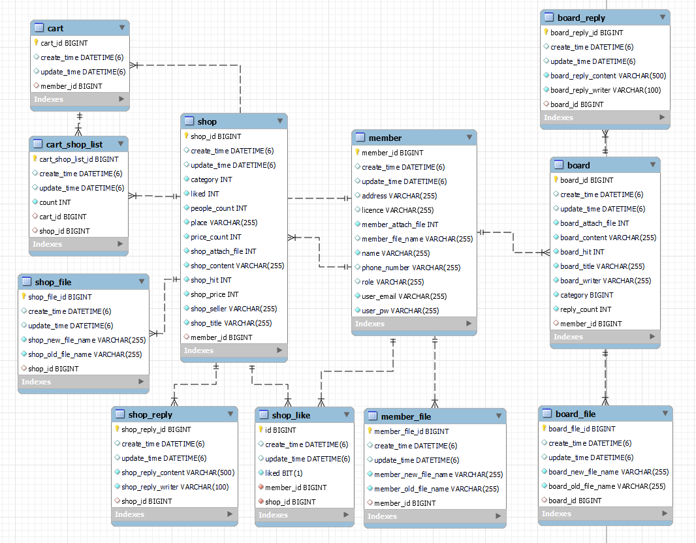

# 😀박준우 1차 프로젝트 CI/CD

### 🛒쇼핑몰 & 관리자 모드 기반 ChatBot 구현

#### **● 프로젝트 명** : E 1 I 4

#### **● 프로젝트 설명** : 원데이 클래스 강의 쇼핑몰 사이트

- **Preview** 
    - 회원가입
       
      
       
       
    - 일반 회원 로그인
       
      
       
       
    - Oauth2 로그인
       
      
       
       
    - 수정, 삭제
       
      

#### **● 프로젝트 소개**

> 사용자에게 참신하고 편리한 서비스를 제공하기 위해 사용자 경험을 중심으로 한 웹사이트 디자인,
> 
> 사용자와 관리자 간의 원활한 커뮤니케이션을 가능하게 하는 챗봇 시스템 등
> 
> 더 투명하고 신뢰할 수 있는 정보를 제공하여 적극적인 참여를 유도하였다.

#### **● 팀원**

> 박준우 (팀장) : DB설계, 회원 CRUD, Oauth2, Security, CI/CD

> 손** (팀원) : 관리자페이지, ChatBot, 강사소개 페이지, 메뉴바, INDEX 애니메이션 기능

> 심** (팀원) : 게시판 CRUD, Naver API

> 이** (팀원) : 상품 CRUD, Cart 담당

> 조** (팀원) : INDEX 페이지, 1:1 문의내역, Naver API

 기술 스택 

| 카테고리       | 요소                                                                                                                 |
|------------|--------------------------------------------------------------------------------------------------------------------|
| 프로그래밍 언어   |  |
| 개발 툴       |               |
| 프레임워크      |      |
| 라이브러리 및 DI | Spring WEB(MVC), Lombok, SpringSecurity5  , websocket, validation, OAuth2                                      |
| 데이터베이스     |                |
| ORM        | Spring Data JPA (JAVA(SQL))                                                                                        |
| 템플릿 엔진     |        |
| Frontend   | css, javaScript, html, ajax                                                                                        |
| 설정         | application.yml, application-oauth2.yml                                                                            |

 프로젝트 일정 

 ER 다이어그램 

기능 구현

### CI/CD

| **No** | **설명**                           |
|--------|----------------------------------|
| 1      | 배포할 파일 github push               |
| 2      | git actions 실행                   |
| 3      | 빌드한 프로젝트 압축                      |
| 4      | 압축된 파일 S3 복사                     |
| 5      | S3에 있는 파일을 CodeDeploy를 통해 EC2 배포 |
| 6      | EC2에서 jar 파일 실행                  |

**[⬆ 위로 가기](#박준우-1차-프로젝트-cicd)**
